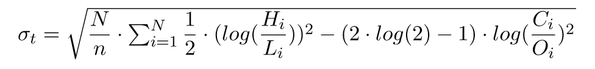
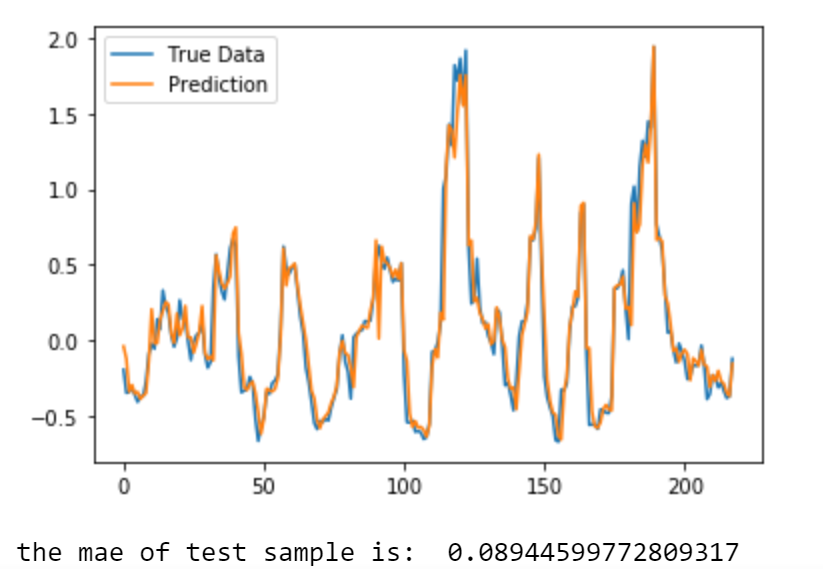
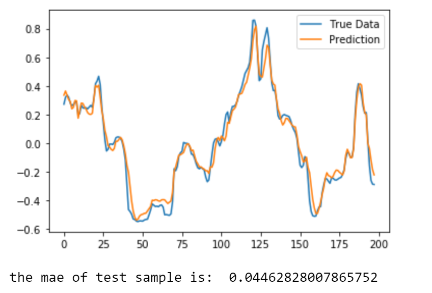
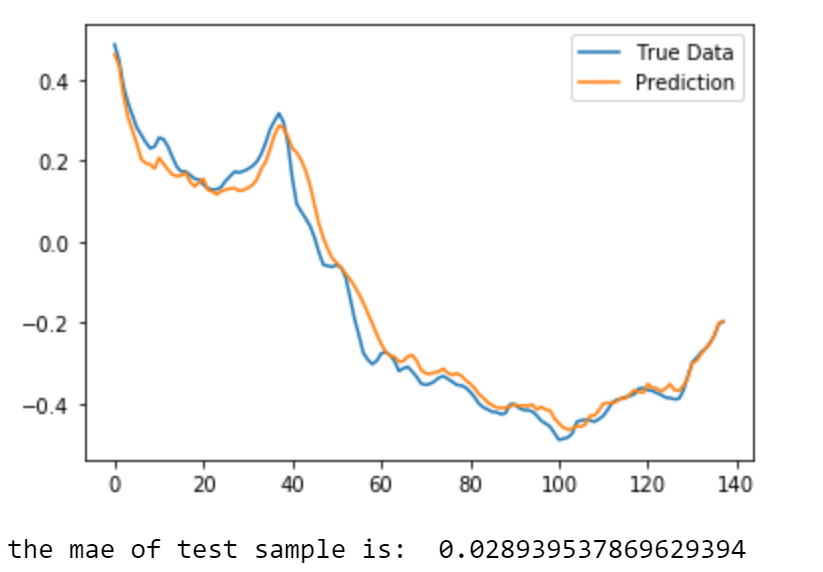
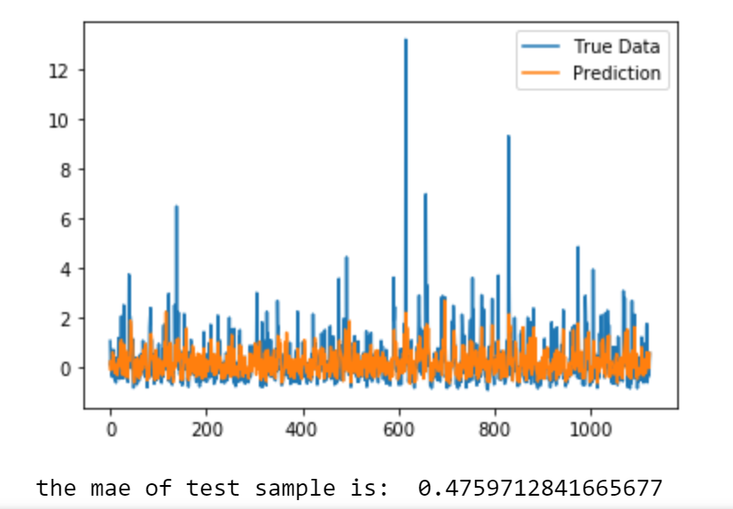
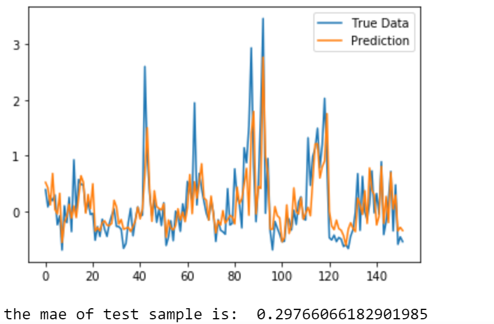

# Volatility Prediction

This project is testing how well the Long Short-Term Memory model (LSTM) works in predicting historical and intra-day volatility on a stock (MSFT). An accurate forecast can benefit a wide range of financial applications from daily margin call to VaR computation in risk management.


### Installation
----------------------------------
##### Data 
  - Daily Stock Prices (close,open,high,low)
  - Volume
  - Dividend
  - Diluted EPS
  - Price to Book
  - Net and long term debt to Ebitda
  
  30 years of the above data is sourced from Intrinio (https://intrinio.com)
  

##### Install the Requirements
  Install the requirements using ```pip install -r requirements.txt```

##### Third Party Packages
  - The LSTM wrapper was constructed by [Jakob Aungiers, Altum Intelligence ltd](Jakob).
  - Minor changes were made in this project (such as loading a pickles file instead of csv files)

### Volatility
----------------------------------
##### Historical Volatility
- Daily Volatility using 10 day rolling window
- Weekly Volatility using 30 day rolling window
- Monthly Volatility using 90 day rolling window

##### Intraday Volatility
Garman- Klass Estimator:

 

N is the number of trading days. n is the sample size. H,L,C,O are high, low, close and open prices for the stock in each of the trading day. 

### Performance
----------------------------------

##### Historical Volatility

- Daily Volatility using returns only

 

- Weekly Volatility using returns and volumes

 

- Monthly Volatility using all features available

 

##### Intraday Volatility

The only feature is returns

- Daily Volatility

 

-Weekly Volatility

 

[//]: # (These are reference links used in the body of this note and get stripped out when the markdown processor does its job. There is no need to format nicely because it shouldn't be seen. Thanks SO - http://stackoverflow.com/questions/4823468/store-comments-in-markdown-syntax)


   [Jakob]: https://github.com/jaungiers/LSTM-Neural-Network-for-Time-Series-Prediction

   